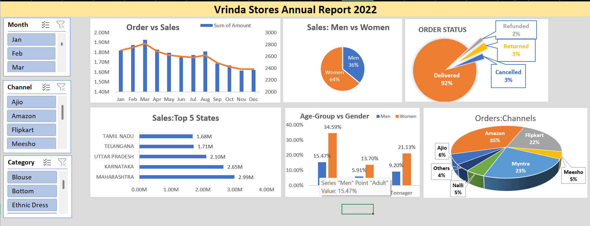

# Vrinda Stores Annual Report 2022 – Excel Dashboard
# Overview
This project presents an interactive sales dashboard for Vrinda Stores (2022) created using Microsoft Excel only. The goal of the project is to analyze sales performance and customer behavior and present insights in a clear, decision-friendly format.The dashboard is designed for business users to quickly assess trends, performance metrics, and operational outcomes without technical complexity.

# Dashboard Highlights
- Order vs Sales Analysis
    - Monthly comparison of total sales amount and order volume.
- Customer Demographics
  - Sales split between Men and Women
  - Age-group vs Gender contribution
- Order Status Breakdown
  - Delivered
  - Cancelled
  - Returned
  - Refunded
- Geographical Performance
  - Top 5 states by total sales value
- Channel Performance
  - Amazon
  - Myntra
  - Flipkart
  - Ajio
  - Meesho
  - Others
- Interactive Filters
    - Month
    - Sales Channel
    - Product Category

# Tools Used
- Microsoft Excel
- Pivot Tables
- Pivot Charts
- Slicers
- Data Cleaning & Transformation
- Dashboard Formatting

# Key Learnings
- Building end-to-end dashboards using Excel
- Converting raw data into actionable insights
- Applying data visualization best practices
- Designing interactive reports for business users

# Preview

# Conclusion
This project demonstrates how Excel can be effectively used for data analysis and business reporting, making it a valuable tool for analysts, especially in entry-level and business-focused roles.
  
